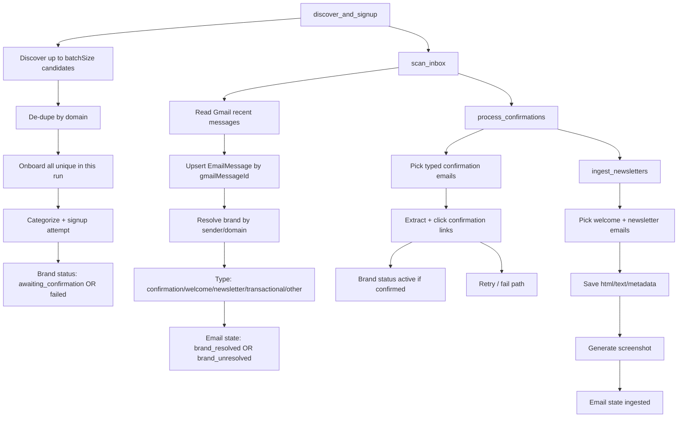

# Brand Onboarding Agent Workflow

## End-to-End Flow

## Batch Size Behavior

- Discovery targets `batchSize` candidates.
- After dedupe, the run onboards all unique candidates from that discovered set.
- There is no extra `*2` expansion and no truncation to first N after dedupe.

## Brand Status Definitions

- `discovered`: Candidate identified but no signup started.
- `subscribing`: Signup automation currently in progress.
- `submitted`: Form was submitted (legacy/optional transitional state).
- `awaiting_confirmation`: Waiting for confirmation/welcome/newsletter email.
- `confirmed`: Confirmation click succeeded (transitional; typically moves to active).
- `active`: Brand is considered onboarded and receiving newsletters.
- `failed`: Signup/confirmation failed or timed out.
- `captcha_blocked`: Bot protection blocked automation.
- `stale`: Previously active but no relevant email seen in staleness window.
- `duplicate`: Candidate rejected due duplicate domain/brand match.
- `skipped`: Manually skipped/removed.

## Email Type Definitions

- `confirmation`: Asks user to confirm/verify subscription.
- `welcome`: First onboarding/welcome note.
- `newsletter`: Recurring marketing/editorial campaign email.
- `transactional`: Order/receipt/shipping/account/system messages.
- `other`: Non-newsletter content that does not match known patterns.
- `unknown`: Not yet classified.

## Where Artifacts and Logs Live

- Newsletter screenshots: `artifacts/newsletters/` (local filesystem of running service).
- Runtime logs: console + `logs/agent.log`.
- Persistent activity logs (Mongo): `activitylogs` collection (30-day TTL).
- Parsed emails and ingest states: `emailmessages` collection.
