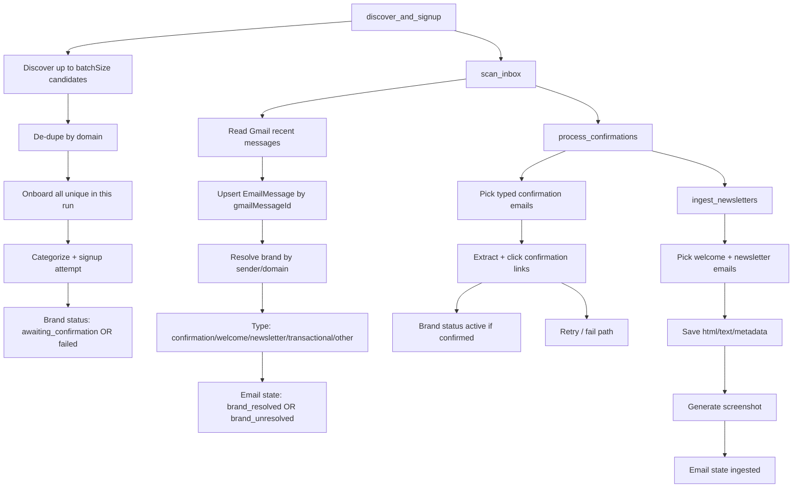

# Brand Onboarding Agent Workflow

## End-to-End Flow

## Batch Size Behavior

- Discovery targets `batchSize` candidates.
- After dedupe, the run onboards all unique candidates from that discovered set.
- There is no extra `*2` expansion and no truncation to first N after dedupe.
- By default discovery source is `claude` (set via `DISCOVERY_SOURCE`).
- Claude discovery stores domain history in Mongo key `claude_discovery_domains` to avoid repeats across runs.

## Brand Status Definitions

- `discovered`: Candidate identified but no signup started.
- `subscribing`: Signup automation currently in progress.
- `submitted`: Form was submitted (legacy/optional transitional state).
- `awaiting_confirmation`: Waiting for confirmation/welcome/newsletter email.
- `confirmed`: Confirmation click succeeded (transitional; typically moves to active).
- `active`: Brand is considered onboarded and receiving newsletters.
- `failed`: Signup/confirmation failed or timed out.
- `captcha_blocked`: Bot protection blocked automation.
- `stale`: Previously active but no relevant email seen in staleness window.
- `duplicate`: Candidate rejected due duplicate domain/brand match.
- `skipped`: Manually skipped/removed.

## Email Type Definitions

- `confirmation`: Asks user to confirm/verify subscription.
- `welcome`: First onboarding/welcome note.
- `newsletter`: Recurring marketing/editorial campaign email.
- `transactional`: Order/receipt/shipping/account/system messages.
- `other`: Non-newsletter content that does not match known patterns.
- `unknown`: Not yet classified.

## Where Artifacts and Logs Live

- Newsletter screenshots: `artifacts/newsletters/` (local filesystem of running service).
- Runtime logs: console + `logs/agent.log`.
- Persistent activity logs (Mongo): `activitylogs` collection (30-day TTL).
- Workflow step history (Mongo): `workflowruns` collection.
- Parsed emails and ingest states: `emailmessages` collection.

## Internal 10-Min Scheduler

- Internal scheduler is configured via env vars and runs inside the service process.
- Default interval is every 10 minutes.
- It continues when your laptop is off only if the service is deployed (Railway/VPS always-on process).
- If you run locally, scheduler stops when your local Node process stops.
- Each tick runs:
  1. `discover_and_signup`
  2. `scan_inbox`
  3. `process_confirmations`
  4. `ingest_newsletters`

### Config

- `INTERNAL_CRON_ENABLED=true`
- `INTERNAL_CRON_INTERVAL_MIN=10`
- `INTERNAL_CRON_INITIAL_DELAY_SEC=30`
- `INTERNAL_CRON_BATCH_SIZE=10`
- `INTERNAL_CRON_INBOX_HOURS=24`
- `INTERNAL_CRON_MAX_INBOX_RESULTS=100`
- `INTERNAL_CRON_STEP_LIMIT=50`

### Where To See It

- Dashboard: `Workflow Step History` panel.
- API: `GET /api/activity/workflow-runs?limit=120`
- API: `GET /api/activity/logs?limit=200` (look for `phase=scheduler`)
- Railway logs: lines starting with `[scheduler]`.

## Claude Discovery Runtime Notes

- `DISCOVERY_SOURCE=claude` (default): try Claude first, then fallback discovery.
- `DISCOVERY_SOURCE=claude_only`: Claude only unless `DISCOVERY_STRICT_CLAUDE=true`.
- `DISCOVERY_STRICT_CLAUDE=false` (default): if Claude/key fails, fallback discovery prevents cycle failure.
- `ANTHROPIC_API_KEY` must be present for Claude generation.
